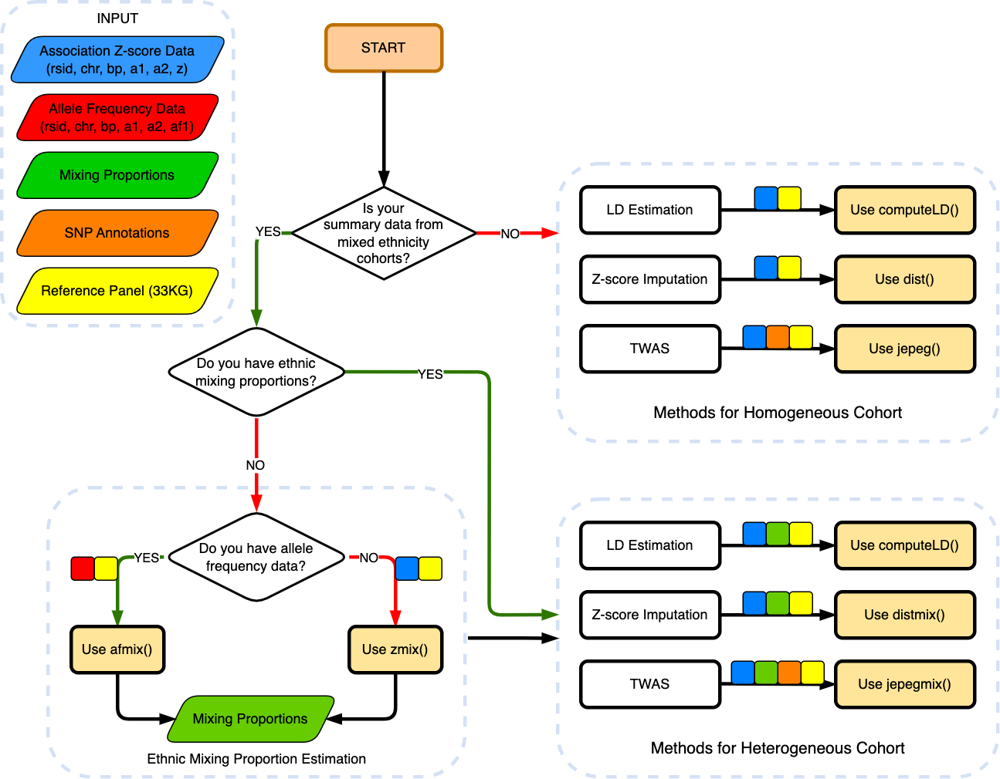

<!-- README.md is generated from README.Rmd. Please edit that file -->

```{r, include = FALSE}
knitr::opts_chunk$set(
  collapse = TRUE,
  comment = "#>",
  fig.path = "man/figures/README-",
  out.width = "100%"
)
```

# PRS-MIX

<!-- badges: start -->
<!-- badges: end -->

PRS-MIX builds **multi-population, mixed LD reference panels for [PRS-CS](https://github.com/getian107/PRScs)** (Ge et al. 2019) and runs PRS-CS's posterior SNP effect sampler against a weighted blend of those panels (e.g. EUR + ASN) instead of a single population's panel. It is a fork of the [GAUSS](https://github.com/statsleelab/gauss) package -- see [Background: GAUSS](#background-gauss) below -- kept as the base because the panel generator calls directly into GAUSS's compiled 33KG reference-panel reader.

For the full rationale, file-by-file breakdown, and cluster setup, see [CLAUDE.md](CLAUDE.md).

## Installation

```r
# install.packages("devtools")
devtools::install_github("statsleelab/PRS-MIX")
```

You'll also need:

- **A GAUSS 33KG reference panel** (index/genotype/population-description files) to build LD panels from.
- **An unmodified [PRS-CS](https://github.com/getian107/PRScs) checkout** on your `PYTHONPATH` (or in the same directory) -- `inst/prscs-mix/PRScs_mix.py` imports PRS-CS's own `mcmc_gtb` and `gigrnd` modules and is not runnable on its own.

## Workflow

### 1. Generate aligned multi-population LD panels

Use `generate_prscs_ld_panels()` to build LD reference panels for two or more superpopulations at once, reconciled so every population's panel keeps the *same* SNPs (in the same order) within each block -- required for PRS-CS's mixing logic to align panels correctly (see the function's docs for why unreconciled panels silently corrupt betas).

```r
panel_dirs <- gauss::generate_prscs_ld_panels(
  reference_index_file      = "33kg_index.gz",
  reference_data_file       = "33kg_geno.gz",
  reference_pop_desc_file   = "33kg_pop_desc.txt",
  superpopulation_labels    = c("EUR", "ASN"),
  output_dir                = "prscs_ref",
  chromosomes               = 1:22,
  block_size                = 250000,
  shrinkage                 = 0.01
)
# panel_dirs -> list(EUR = "prscs_ref/ldblk_1kg_eur33kg", ASN = "prscs_ref/ldblk_1kg_asn33kg")
```

For a single population's panel (no cross-population reconciliation needed), use `generate_prscs_ld_panel()` instead -- see `inst/scripts/generate_prscs_ld_chr_example.R` for a runnable, chr22-only example of both.

### 2. Run PRS-CS with the mixed reference panels

`inst/prscs-mix/PRScs_mix.py` takes a comma-separated `--ref_dir` list and matching `--mix_props`:

```bash
python inst/prscs-mix/PRScs_mix.py \
  --ref_dir=prscs_ref/ldblk_1kg_eur33kg,prscs_ref/ldblk_1kg_asn33kg \
  --mix_props=0.7,0.3 \
  --bim_prefix=/path/to/target/plink_prefix \
  --sst_file=/path/to/sumstats.txt \
  --n_gwas=100000 \
  --out_dir=/path/to/output \
  --chrom=22
```

`mix_props` must have one weight per `ref_dir` entry, in the same order. See `inst/prscs-mix/README.md` for the SNP-intersection fix these scripts carry relative to upstream PRS-CS, and PRS-CS's own docs for the remaining parameters (`--a`, `--b`, `--phi`, `--n_iter`, etc.).

### 3. (Optional) Verify a generated panel against PRS-CS's own reference

`inst/scripts/verify_panel_vs_prscs_reference.R` compares a panel from step 1 against PRS-CS's published 1000G reference panel for the same population/chromosome, since the two use different (and non-comparable) block partitions:

```bash
Rscript inst/scripts/verify_panel_vs_prscs_reference.R \
  prscs_ref/ldblk_1kg_eur33kg ldblk_1kg_eur 22 chr22_eur_vs_prscs.png EUR
```

See `inst/scripts/results/chr22_eur_vs_prscs_aligned.png` for a worked example output.

## Repository layout

- `R/prscs_ld_panel.R` -- `generate_prscs_ld_panel()` / `generate_prscs_ld_panels()` / `finalize_prscs_snpinfo()`.
- `inst/prscs-mix/` -- vendored, patched `PRScs_mix.py` / `v2parse_genet_mix.py`.
- `inst/scripts/` -- runnable examples: panel generation, cross-panel MAF/SNP-overlap comparison, and verification against PRS-CS's own reference.
- `tests/testthat/test-prscs-ld-panel.R` -- unit tests for the panel generator.
- `cluster/redhawk.yml` -- RedHawk (Miami University) SLURM job config.

## Background: GAUSS

GAUSS (Genome Analysis Using Summary Statistics) is the R package PRS-MIX is forked from. It analyzes multi-ethnic GWAS summary statistics using a 32,953-genome, 29-population reference panel (the [33KG Panel](https://statsleelab.github.io/gauss/articles/ref_33KG.html): 20,281 Europeans, 10,800 East Asians, 522 South Asians, 817 Africans, and 533 Native Americans), offering tools to: i) estimate ancestry proportions (`afmix()`, `zmix()`), ii) calculate ancestry-informed LD (`computeLD()`), iii) impute Z-scores for unmeasured variants (`dist()`, `distmix()`), iv) run transcriptome-wide association studies (`jepeg()`, `jepegmix()`), and v) correct for Winner's Curse bias (`fiqt()`). PRS-MIX only uses GAUSS's reference-panel reader and LD computation (`computeSuperPopLDWindow()`); the rest of GAUSS's toolset ships here unmodified as part of the shared package base.

```{r echo=FALSE, fig.align='center', fig.cap='', out.width='100%'}

```

For GAUSS's own suggested workflow and full vignettes, see the [upstream GAUSS repository](https://github.com/statsleelab/gauss) and [vignettes site](https://statsleelab.github.io/gauss/).

## Citing GAUSS

Lee and Bacanu. GAUSS: a summary-statistics-based R package for accurate estimation of linkage disequilibrium for variants, Gaussian imputation, and TWAS analysis of cosmopolitan cohorts. [Bioinformatics](https://doi.org/10.1093/bioinformatics/btae203).

## Authors

Grace Koo <koogc@miamioh.edu>
Donghyung Lee <leed13@miamioh.edu>
